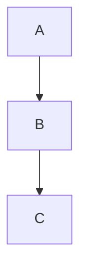

## Finding a New ISP

Internet speeds in the UK tend to be rather abysmal for their asking price. 

As of writing, I'm with Plusnet who are charging me ~£20/m for a 36Mb/s down, 10Mb/s up connection with a phone line. This is on a VDSL copper line.

Self hosting somehow survives these speeds just fine for the websites and such that I run but I've been eyeing up a faster connection for some time now to improve my file transferring capabilities.

Unfortunately there is a speed limit on copper wires of 80Mb/s down, 20Mb/s up and that's in a best case scenario. My dreams of Gigabit internet are going to require a bit more effort.

Now, I think it's safe to get rid of my landline in this day and age, so let's aim for that target of Gigabit internet (ignoring contract length and setup fees) and see what we can find:

| ISP | Up/Down Mb/s | Cost/Month |
|---|---|---|
| Virgin Media | 1130/104 | £45 |
| BT | 900/110 | £43 |
| Plusnet | 900/115 | £50 |
| Sky | 900/100 | £58 |
| Community Fibre | 920/920 | £25 |

Do you see the odd one out? Clearly Community Fibre woke up and chose violence. Not only do they have the second highest average down speed, their upload speed is as high as the download. All for half the price of the other offerings.

"Yeah that's great and all, but there must be a catch..." is what you're probably saying about now. I asked the same question and this post will detail what I found.

## Carrier-Grade Network Address Translation

Also known as CGNAT; It is the ISP's solution to dwindling IPv4 address space. Let's break it down:

Network Address Translation (NAT) is the protocol that allows one public IPv4 address to be used by multiple devices, each with it's own private IPv4 address. Generally, an ISP will hand your router/gateway a public IPv4 address and your router will give each device that connects to it a private one. Then as outgoing packets pass through the router, return addresses are switched from private ones to the public one and vice versa for the responses. It's all very clever, and I suggest learning more about it; Perhaps I'll go into more detail in a future post.

So what makes it _Carrier-Grade_? CGNAT is, at it's core, just a second layer of NAT. Where the usual private IPs are `192.168.0.0/16`, `10.0.0.0/8`, etc., CGNAT has the `100.0.0.0/8` range assigned to it. So it looks something like this:

